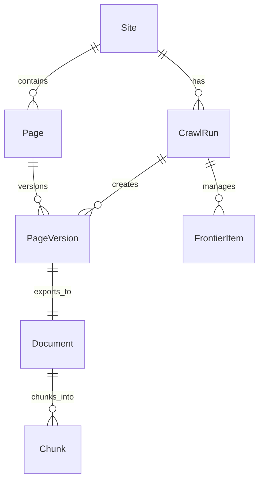

# Models

Data models used throughout ragcrawl.

## Overview

ragcrawl uses Pydantic models for type-safe data handling:

| Model | Description |
|-------|-------------|
| [Document](document.md) | Crawled page content for output |
| [Site](site.md) | Crawl configuration and metadata |
| [Page](page.md) | Page state and freshness tracking |
| [Chunk](chunk.md) | Content chunks for embeddings |
| `PageVersion` | Versioned content snapshots |
| `CrawlRun` | Crawl execution records |
| `FrontierItem` | URL queue items |

## Model Relationships



## Quick Reference

### Document

The output model for crawled content:

```python
from ragcrawl.models import Document

doc = Document(
    doc_id="abc123",
    page_id="abc123",
    source_url="https://example.com/page",
    normalized_url="https://example.com/page",
    markdown="# Page Title\n\nContent here...",
    title="Page Title",
    status_code=200,
    content_type="text/html",
    depth=1,
    run_id="run_xyz",
    site_id="site_abc",
    first_seen=datetime.now(),
    last_seen=datetime.now(),
    last_crawled=datetime.now(),
)
```

### Site

Configuration snapshot for a crawled site:

```python
from ragcrawl.models import Site

site = Site(
    site_id="site_abc123",
    name="Example Docs",
    seeds=["https://docs.example.com"],
    allowed_domains=["docs.example.com"],
    created_at=datetime.now(),
    updated_at=datetime.now(),
)
```

### Chunk

Content chunk for embeddings:

```python
from ragcrawl.models import Chunk

chunk = Chunk(
    chunk_id="chunk_001",
    doc_id="abc123",
    content="This is the chunk content...",
    chunk_index=0,
    total_chunks=5,
    section_path=["Introduction", "Overview"],
    heading="Overview",
    token_estimate=150,
)
```

## Module Reference

::: ragcrawl.models
    options:
      show_root_heading: false
      members:
        - Document
        - Site
        - Page
        - PageVersion
        - Chunk
        - CrawlRun
        - FrontierItem
